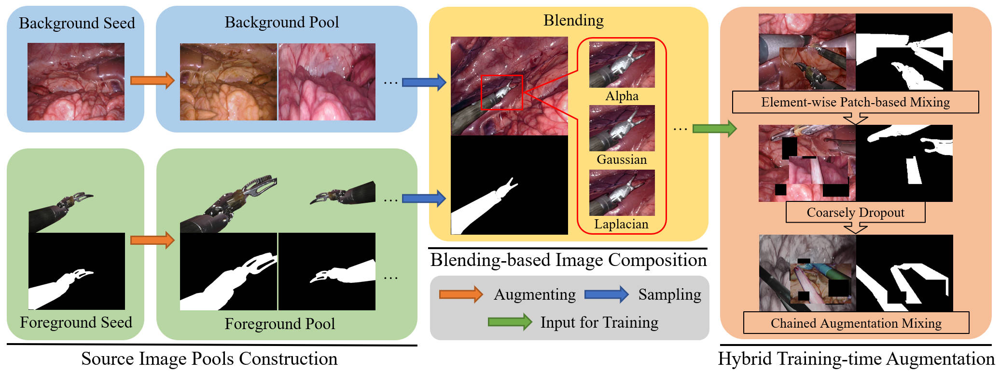

# OneToMany_ToolSynSeg
Codes for the paper 

**Generalizing Surgical Instruments Segmentation to Unseen Domains with One-to-Many Synthesis**.

An Wang*, Mobarakol Islam*, Mengya Xu, and Hongliang Ren**

*: First author; **: Corresponding author

> Although deep learning-based methods have shown impressive performance in various surgical applications, like instrument segmentation, report generation, and visual question answering, their deployment efficacy is frequently challenged due to many practical issues. One of the most demanding challenges arises from their dependency on sufficient well-labeled data from real surgical scenes for training, which is costly to collect and annotate. Besides, domain shifts also damage their performance a lot.

> In this work, we aim to mitigate the urgent need for real data when training deep learning models and let the model generalize to unseen domains. We think they are vital to improving surgical robotic autonomy and perception in practice. From a data-centric point of view, we propose the One-to-Many surgical instrument synthesis and segmentation framework. Specifically, we consider improving synthetic data quality from two aspects, i.e., the realism of each image during synthesizing and the diversity of the entire dataset during training. Hence, when synthesizing, we extensively explore three blending techniques to find the optimal synthesizing quality. During training, we incorporate Chained Augmentation Mixing, Coarsely Dropout, and Element-wise Patch Mixing into a hybrid form. We also get rid of manual annotation effort because the segmentation masks are simultaneously generated along the process. Extensive experiments across multiple domains suggest that our framework can achieve close and even superior performance compared with training with the real dataset. Moreover, we find that weak supervision from little real data can effectively boost the generalization performance.

> In summary, we propose a novel data-efficient surgical instrument synthesis and segmentation framework with minimal image sources. We hope our methods can provide insights into how to efficiently leverage synthetic data for training generalizable deep learning models.




  - [Environments](#environments)
  - [Dataset Generation](#dataset-generation)
    - [Augmentation of background tissue image](#augmentation-of-background-tissue-image)
    - [Augmentation of foreground instruments images](#augmentation-of-foreground-instruments-images)
    - [Blending of composited training samples](#blending-of-composited-training-samples)
  - [Instruments Segmentation](#instruments-segmentation)
  - [Acknowledgements](#acknowledgements)
  - [Citation](#citation)

## Environments

* Python=3.8
* Pytorch=1.10
* torchvision=0.11.2
* cuda=11.3
* imgaug=0.4.0
* albumentations=1.1.0
* comet_ml=3.2.0 (used for experiments logging, remove where necessary if you don't need)
* Other commonly seen dependencies can be installed via pip/conda.

## Dataset Generation

### Augmentation of background tissue image
In ./data_gen/srcdata/bg/, the source background tissue image is provided. Adapt `aug_bg.ipynb` to generate augmented background images.

### Augmentation of foreground instruments images
In ./data_gen/srcdata/fg/, different types of instruments with of image-mask pairs are provided (Note: there are 2 versions of Bipolar Forceps in Endovis-2018 dataset.). Adapt `aug_fg.ipynb` to generate augmented foreground images.

### Blending of composited training samples
In ./data_gen/syndata/, adapt `blend.ipynb` to generate the blended images used for training.

## Instruments Segmentation

To evaluate the quality of the generated synthetic dataset, binary instrument segmentation is adopted. 

Example training commands:

1. train on Endo18 dataset
```
CUDA_VISIBLE_DEVICES=0,1 python src/train.py --train_dataset Endo18_train --augmix I --augmix_level 2 --coarsedropout hole14_w13_h13_p5 --cutmix_collate FastCollateMixup
```

2. train on Synthetic dataset
```
CUDA_VISIBLE_DEVICES=0,1 python src/train.py --train_dataset Syn-S3-F1F2 --blend_mode alpha --augmix I --augmix_level 2 --coarsedropout hole14_w13_h13_p5 --cutmix_collate FastCollateMixup
```

3. joint train: 90% Syn-S3-F1F2 + 10% Endo18
```
CUDA_VISIBLE_DEVICES=0,1 python src/train.py --train_dataset Joint_Syn-S3-F1F2 --blend_mode alpha --real_ratio 0.1 --augmix I --augmix_level 2 --coarsedropout hole14_w13_h13_p5 --cutmix_collate FastCollateMixup
```

4. joint train: Syn-S3-F1F2 + 10% Endo18
```
CUDA_VISIBLE_DEVICES=0,1 python src/train.py --train_dataset Syn-S3-F1F2_inc_Real --blend_mode alpha --inc_ratio 0.1 --augmix I --augmix_level 2 --coarsedropout hole14_w13_h13_p5 --cutmix_collate FastCollateMixup
```


## Acknowledgements

Part of the codes are adapted from [robot-surgery-segmentation](https://github.com/ternaus/robot-surgery-segmentation) and [pytorch-image-models](https://github.com/rwightman/pytorch-image-models).

## Citation
```
@misc{wang2022generalizing,
    title={Generalizing Surgical Instruments Segmentation to Unseen Domains with One-to-Many Synthesis},
    author={An Wang and Mobarakol Islam and Mengya Xu and Hongliang Ren},
}
```
The code structure mainly from our previous code [Single_SurgicalScene_For_Segmentation](https://github.com/lofrienger/Single_SurgicalScene_For_Segmentation) for MICCAI-2022 paper [**Rethinking Surgical Instrument Segmentation: A Background Image Can Be All You Need**](https://arxiv.org/abs/2206.11804).
```
@inproceedings{wang2022rethinking,
  title={Rethinking Surgical Instrument Segmentation: A Background Image Can Be All You Need},
  author={Wang, An and Islam, Mobarakol and Xu, Mengya and Ren, Hongliang},
  booktitle={International Conference on Medical Image Computing and Computer-Assisted Intervention},
  pages={355--364},
  year={2022},
  organization={Springer}
}
```
